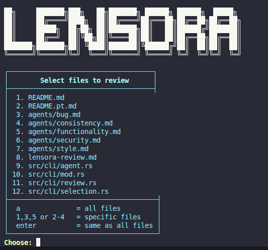
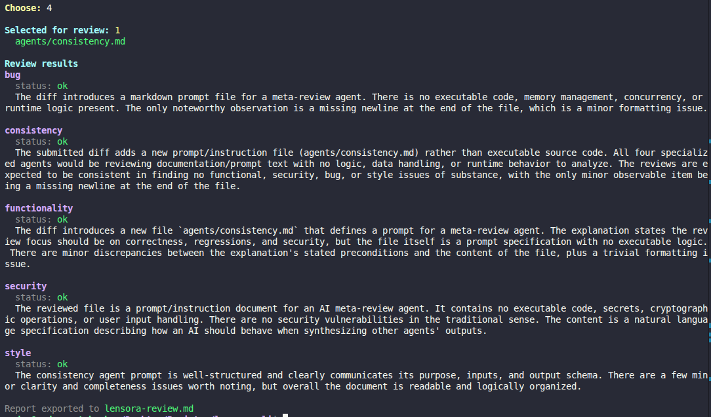

# Lensora CLI

Lensora is a Rust CLI for reviewing uncommitted Git diffs with specialized LLM review agents.

Portuguese version: [README.pt.md](README.pt.md)

## Overview

The current flow is:

1. Read uncommitted changes from the Git repository.
2. Show an interactive selection of changed files.
3. Allow choosing one file, multiple files, or all files.
4. Load agent prompts from the `agents/` directory.
5. Send each selected diff to an LLM provider.
6. Print a clean per-agent summary in the terminal.

## Features

- Diff collection from both the working tree and staged area.
- Interactive file selection with a styled terminal menu.
- Multi-provider support:
  - Anthropic
  - OpenAI
- TOML-based configuration.
- Direct API key support in TOML with optional environment fallback.
- Agent loading from `.md` files in `agents/`.
- Organized terminal output with spacing between agent previews.
- Review-only flow: Lensora does not generate or apply patches.

## Current status

The project already includes:

- Rust CLI foundation with `clap`
- TOML config loading
- Diff discovery and per-file grouping
- Interactive file selection
- Review agent orchestration
- HTTP clients for Anthropic and OpenAI
- Colored terminal formatting

## Project layout

```text
.
├── Cargo.toml
├── README.md
├── README.pt.md
├── lensora.toml
├── lensora.example.toml
├── agents/
└── src/
    └── cli/
```

## Configuration

Create a local `lensora.toml` from the example:

```bash
cp lensora.example.toml lensora.toml
```

Example configuration:

```toml
[provider]
name = "anthropic"
model = "claude-sonnet-4-6"
api_key = "YOUR_API_KEY_HERE"

[ignore]
paths = ["target/", "Cargo.lock"]

[repo]
preconditions = ["Focus on correctness, regressions, and security."]

[output]
path = "lensora-review.md"
```

### Provider

- `name`: `anthropic` or `openai`
- `model`: LLM model ID
- `api_key`: direct key stored in TOML

If `api_key` is omitted, Lensora falls back to:

- `ANTHROPIC_API_KEY` for Anthropic
- `OPENAI_API_KEY` for OpenAI

### Ignore

Use this section to exclude files or path patterns from the review input.

### Repo

Use this section for fixed repository notes, preconditions, or context that should always be included in the review prompt.

### Output

`output.path` is reserved for future report export support and is already part of the config model.

## Agents

Each `.md` file in `agents/` defines a specialized review agent.

Current agents:

- `bug.md`
- `consistency.md`
- `functionality.md`
- `security.md`
- `style.md`

They are loaded at runtime and receive the selected diff plus review context.

## Run

```bash
cargo run
```

To inspect the loaded config only:

```bash
cargo run -- --print-config
```

## Terminal output

Lensora prints:

- an initial header with the config path
- the list of changed files
- a colored file-selection menu
- separated per-agent review previews

## Screenshots

Request:



Response:



## Development

Check the project with:

```bash
cargo check
```

Run tests with:

```bash
cargo test
```